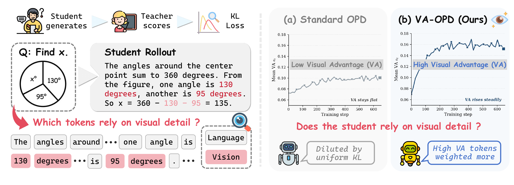
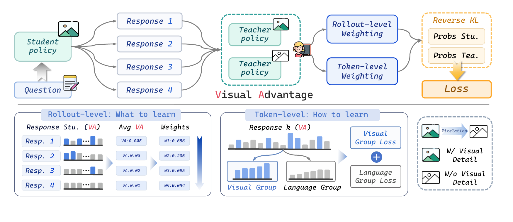
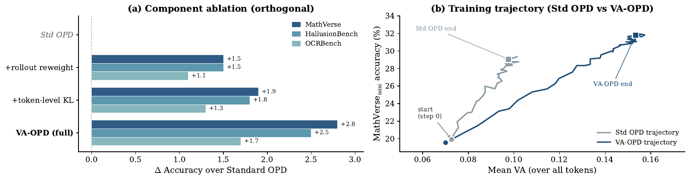
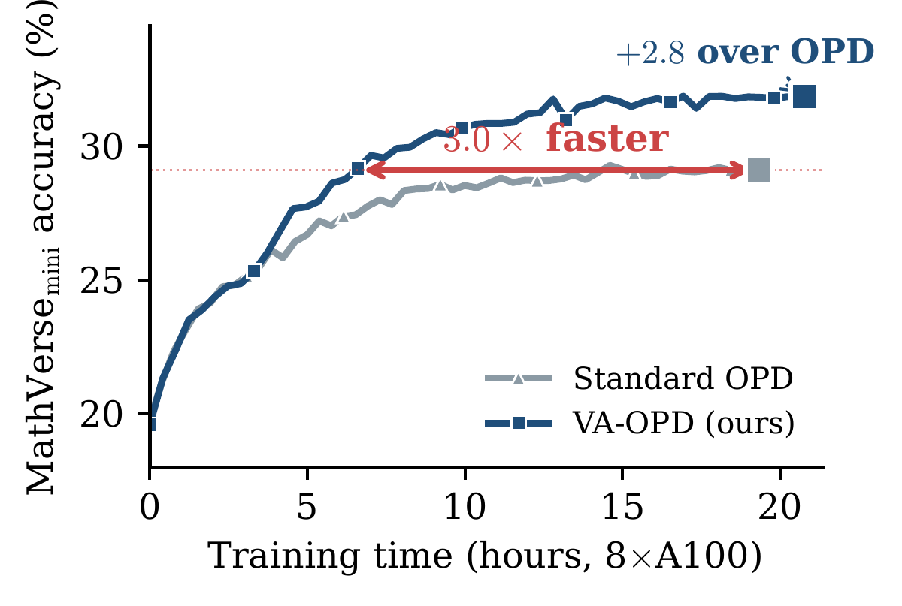

<div align="center">

# 👁️ VA-OPD

### Visual-Advantage On-Policy Distillation

**Teaching Vision-Language Models to Learn from Fine-Grained Visual Detail**

[](https://arxiv.org/abs/2605.21924)
[](LICENSE)
[](https://www.python.org/)
[](https://pytorch.org/)
[](https://github.com/handsome-rich/VA-OPD)

[🇨🇳 中文文档](README_zh.md) · [📄 Paper](https://arxiv.org/abs/2605.21924) · [📊 Results](#-results) · [🚀 Quick Start](#-quick-start) · [📚 Citation](#-citation)



</div>

---

**VA-OPD** uses a frozen teacher to identify which tokens in a student-generated response depend on fine-grained visual detail. The teacher scores each response with the original image and a pixelated image; their positive log-probability difference is the token's **visual advantage (VA)**.

VA then guides distillation at two levels: **weighting sibling rollouts** by their relative visual reliance and **averaging reverse KL separately over high-VA and low-VA tokens**. This gives the sparse visual signal a larger share of the training objective while retaining language supervision.

In the paper's Qwen3-VL-8B → 2B setting, VA-OPD improves over Standard OPD on all eight benchmarks: **+2.9 points on Math Avg** and **+1.5 points on Visual Avg**.

---

## ✨ Highlights

| | |
|---|---|
| 👁️ **Teacher-measured visual reliance** | Compare token probabilities with original and pixelated images, keeping image dimensions and visual-token alignment unchanged. |
| 🔄 **Two levels of weighting** | Prefer visually engaged rollouts and balance KL supervision within high-VA and low-VA token groups. |
| 🧮 **Direct reverse-KL objective** | Optimize the full-vocabulary student-to-teacher KL on student-generated trajectories. |
| 📈 **Consistent gains** | Paper-reported gains across 4B, 8B and 32B teachers, with a fixed 2B student, and across Geometry3K and ViRL39K. |
| 🧩 **Focused implementation** | A standalone objective, paper-aligned recipes, Standard OPD baseline, and documented evaluation protocol. |

---

## 🧭 How It Works

<div align="center">

</div>

### 1. Measure visual advantage

Generate $K=4$ responses for each image–query pair. For each response token, evaluate the frozen teacher under both image conditions, with exactly the same query and response prefix:

$$
a_t = \max\!\left(\log p_T(y_t \mid v,q,y_{<t})-\log p_T(y_t \mid \tilde v,q,y_{<t}),\;0\right).
$$

The pixelated image $\tilde v$ is bilinearly downsampled to **10% of each spatial dimension**, then resized back with nearest-neighbor interpolation. Pixelation is used only to measure VA; the KL target always comes from the teacher conditioned on the **original image**.

### 2. Weight rollouts and group tokens

Average VA over each response's valid tokens, standardize those averages within the $K$ sibling rollouts, and apply a softmax with temperature $\tau=1$. Within each response, place the **top 20%** of tokens by VA in $V$ and the remaining tokens in $L$.

### 3. Optimize grouped reverse KL

$$
\mathcal L = \frac{1}{B}\sum_{b=1}^{B}\sum_{k=1}^{K}w_b^{(k)}
\left[
\frac{\lambda}{|V_b^{(k)}|}\sum_{t\in V_b^{(k)}}\mathrm{KL}_t
+\frac{1-\lambda}{|L_b^{(k)}|}\sum_{t\in L_b^{(k)}}\mathrm{KL}_t
\right],
\qquad \lambda=0.5,
$$

where $\mathrm{KL}_t=D_{\mathrm{KL}}(p_S(\cdot\mid v,q,y_{<t})\,\|\,p_T(\cdot\mid v,q,y_{<t}))$. Prompt and padding tokens are excluded. Teacher scores and weighting coefficients are detached from gradients, and the objective is averaged over **prompts**. See [`va_opd/objective.py`](va_opd/objective.py) and the [implementation notes](docs/reproduction.md).

The runtime reuses the original-image teacher forward for both VA and KL, adds one pixelated-image teacher pass, and synchronizes only rollout statistics across data-parallel ranks.

---

## 📊 Results

**Results from the paper.** All scores use **avg@8 at temperature 1.0**, with the benchmark-specific official metrics described in the [evaluation protocol](docs/evaluation.md).

### Qwen3-VL-8B → Qwen3-VL-2B · Geometry3K

| Method | WeMath | MathVista | MathVerse | Math Avg | HalluB | AI2D | MMMU | MMStar | OCRBench | Visual Avg |
|---|---:|---:|---:|---:|---:|---:|---:|---:|---:|---:|
| Base | 36.8 | 63.9 | 19.6 | 40.1 | 52.6 | 77.8 | 49.1 | 56.1 | 85.9 | 64.3 |
| CoT-SFT | 39.7 | 64.4 | 23.9 | 42.7 | 51.0 | 75.7 | 48.7 | 57.1 | 86.2 | 63.7 |
| Off-policy KD | 38.9 | 65.3 | 24.3 | 42.8 | 52.3 | 76.0 | 49.3 | 57.4 | 85.5 | 64.1 |
| GRPO | 44.1 | 64.6 | 24.9 | 44.5 | 54.0 | 77.5 | **52.9** | 57.8 | 84.8 | 65.4 |
| PAPO | 44.8 | 64.5 | 25.8 | 45.0 | 54.0 | 77.8 | 52.7 | 58.0 | 84.7 | 65.4 |
| Standard OPD | 43.3 | 63.7 | 29.1 | 45.4 | 52.0 | 75.8 | 50.9 | 59.7 | 84.7 | 64.6 |
| **VA-OPD** | **46.6** | **66.4** | **31.9** | **48.3** | **54.5** | **78.2** | 51.5 | **59.9** | **86.4** | **66.1** |

### Scaling teacher size and training data

| Teacher → Student | Training data | Standard OPD Math / Visual | VA-OPD Math / Visual | Gain Math / Visual |
|---|---|---:|---:|---:|
| 4B → 2B | Geometry3K | 45.3 / 64.4 | **47.4 / 65.2** | +2.1 / +0.8 |
| 8B → 2B | Geometry3K | 45.4 / 64.6 | **48.3 / 66.1** | +2.9 / +1.5 |
| 32B → 2B | Geometry3K | 51.1 / 65.3 | **54.8 / 67.3** | +3.7 / +2.0 |
| 8B → 2B | ViRL39K | 46.4 / 65.5 | **50.2 / 68.0** | +3.8 / +2.5 |

### Ablation and training efficiency

<div align="center">

<br>

</div>

On the paper's 8×A100 setup, VA-OPD reaches Standard OPD's final MathVerse accuracy in approximately **6.5 hours versus 19.3 hours**, a **3× speedup** at the same accuracy target.

---

## 🚀 Quick Start

### 1. Install

Use Python 3.10+ and a CUDA environment compatible with the training dependencies. The training extra pins **vLLM 0.17.1**, which resolves **PyTorch 2.10.0**, and **Transformers ≥4.57, <5**. Use a compatible [PyTorch CUDA build](https://pytorch.org/get-started/locally/).

```bash
git clone https://github.com/handsome-rich/VA-OPD.git
cd VA-OPD

pip install -e ".[train,dev]"
pip install flash-attn --no-build-isolation
```

The training runtime uses the bundled **verl / EasyR1** framework. The VA-OPD objective and public training recipes live under `va_opd/` and `configs/`; framework attribution is retained in [NOTICE](NOTICE).

Run the objective, configuration, data and aggregation checks:

```bash
pip install -e ".[data,dev]"
pytest -q
python -m va_opd.train --config configs/va_opd.yaml --dry-run
```

### 2. Prepare Geometry3K

```bash
python -m va_opd.prepare_data \
  --dataset geometry3k \
  --output-dir data/geometry3k
```

The recipe keeps the official **2,101 training examples** and selects **200 examples from the official validation split** with seed **42** for checkpoint selection. The preparation manifest records the selection seed and sample IDs.

### 3. Train VA-OPD or Standard OPD

```bash
# Default: Qwen3-VL-8B-Instruct teacher → Qwen3-VL-2B-Instruct student.
bash scripts/train.sh

# Same training recipe, uniform Standard OPD objective.
METHOD=opd bash scripts/train.sh

# Alternative teacher sizes.
TEACHER_PATH=Qwen/Qwen3-VL-4B-Instruct bash scripts/train.sh
TEACHER_PATH=Qwen/Qwen3-VL-32B-Instruct bash scripts/train.sh
```

Model paths can be Hugging Face identifiers or local checkpoint directories. The paper's training setup uses a single node with **8×A100-80GB GPUs** and bf16 precision.

### 4. Train on ViRL39K

Prepare Geometry3K first to retain the same 200-example checkpoint-selection set.

```bash
python -m va_opd.prepare_data \
  --dataset virl39k \
  --output-dir data/virl39k

DATASET=virl39k bash scripts/train.sh
```

### 5. Evaluate

Select a checkpoint on the held-out Geometry3K set, then evaluate the eight benchmarks. Generate **eight responses per example at temperature 1.0** using the released benchmark prompts, extract the first committed answer, and score with each benchmark's official evaluator and judge prompts. See [`docs/evaluation.md`](docs/evaluation.md) for splits, scorer settings and export format.

Export the official scorer outputs in the schema described in that document, then aggregate them:

```bash
python -m va_opd.evaluation --results official_results.json --output scores.json
```

The test suite covers the objective, configuration, data preparation and metric aggregation, including two-rank Gloo checks.

---

## ⚙️ Paper Recipe

Defaults are specified in [`configs/va_opd.yaml`](configs/va_opd.yaml). The same settings apply to Standard OPD for a controlled comparison.

| Setting | Paper default |
|---|---|
| Student / teacher | Qwen3-VL-2B-Instruct / Qwen3-VL-8B-Instruct |
| Prompt batch / rollouts | 16 prompts / 4 responses each |
| Training epochs | 5 |
| Optimizer | AdamW, β₁=0.9, β₂=0.95, weight decay=0.1 |
| Learning rate / schedule | 1×10⁻⁶ / cosine decay, 5% linear warmup |
| Rollout sampling | Temperature 0.7, top-p 0.95 |
| Maximum response length | 4,096 tokens; truncate over-budget responses |
| Precision / accumulation | bf16 / no gradient accumulation |
| VA parameters | Pixelation=0.10, τ=1.0, ε=10⁻⁶, high-VA fraction=0.2, λ=0.5 |
| Evaluation | Temperature 1.0, avg@8 |
| Judge, where required | `gpt-4o-2024-08-06`, temperature 0, official benchmark prompts |
| Checkpoint selection | 200 held-out Geometry3K problems |

The prompt length limit is **8,192 tokens**. Image preprocessing, sample selection, token ranking and distributed normalization are described in the [implementation notes](docs/reproduction.md).

---

## 📚 Citation

```bibtex
@article{liu2026vaopd,
  title={Visual-Advantage On-Policy Distillation for Vision-Language Models},
  author={Liu, Ruiqi and Lv, Xiaolei and Li, Gengsheng and Zhu, Ximo and
          Wang, Zhiheng and Zhang, Zhengbo and Chen, Junkai and Li, Zhiheng and
          Li, Bo and Gao, Jun and Wu, Shu},
  journal={arXiv preprint arXiv:2605.21924},
  year={2026}
}
```

## 📬 Contact & License

- **Issues:** [VA-OPD issue tracker](https://github.com/handsome-rich/VA-OPD/issues)
- **Email:** `ruiqi.liu24@nlpr.ia.ac.cn`
- **Code:** [Apache License 2.0](LICENSE), with framework notices in [NOTICE](NOTICE).
- **Figures:** Rendered from the authors' supplied paper sources; paper figure rights remain with their authors.

---

<div align="center">
<sub>👁️ Learn the tokens that depend on seeing.</sub>
</div>
